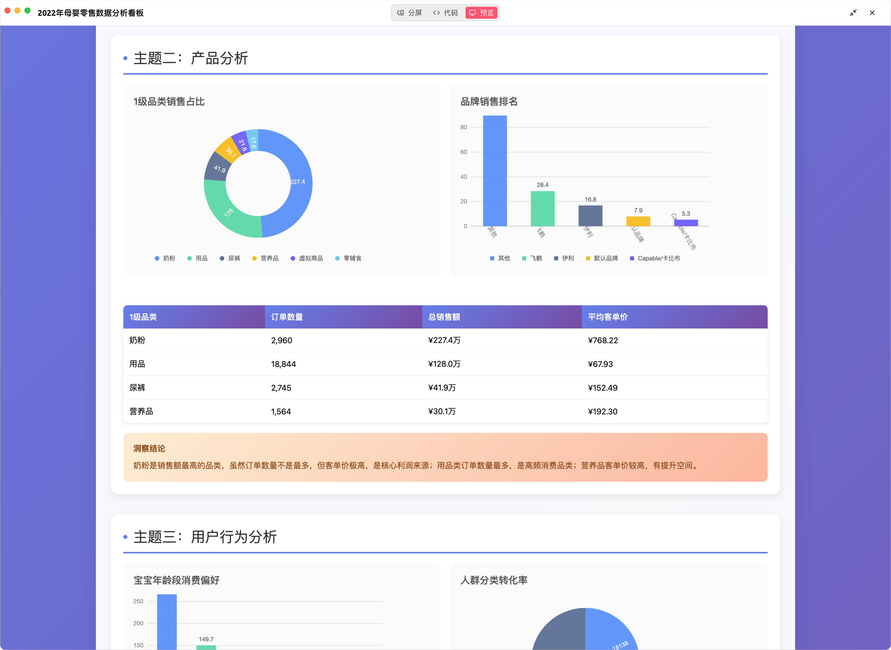

# ChatBI MCP Server

## 准备环境

### 配置LLM API Key

```bash
cp .env.example .env
```
编辑`.env`文件，填写LLM信息，要生成代码，建议填写相对比较强的模型，比如GLM 4.5、Qwen-235B-A22B、Kimi K2等，至少Qwen3-32B，规模再小的生成代码质量会比较差，分析效果差。

### 安装依赖

```bash
uv venv .venv --python=3.11
source .venv/bin/activate
uv pip install -r requirements.txt
```

## 运行服务

```bash
cd src
python pandas_mcp_server.py
```
## 使用

### 配置ChatBI MCP Server

使用任意支持MCP Server的客户端，比如Cherry Studio，配置如下：


其中验证信息，在`config.yaml`中，可以自行修改。默认值为`eyJzdWIiOiAidXNlcjEyMyIsICJpYXQiOiAxNzUxODA5ODIwLCAiZXhwIjogMTc1MTgxMzQyMH0`。
> 注意：超时时间设置长一点，因为涉及LLM生成代码、如果出错还需要改错

添加完成后，点击“保存”，然后点击又上方的开启选项，切换到“工具”标签页：

如果能正常列出工具，说明配置正确。


### 使用ChatBI MCP Server

#### 常规统计

使用时，记得开启这个MCP Server：


#### 可视化

结合[mcp-server-chart](https://github.com/antvis/mcp-server-chart)使用


### 综合运用

通过指令，自动化数据分析：

生成数据分析计划：

开始分析：

结果报告：


生成的看板：
